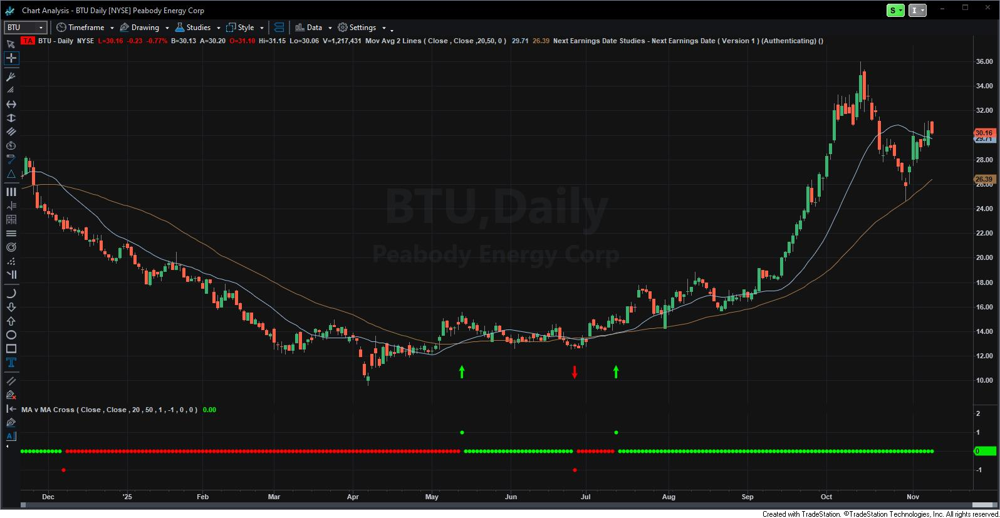
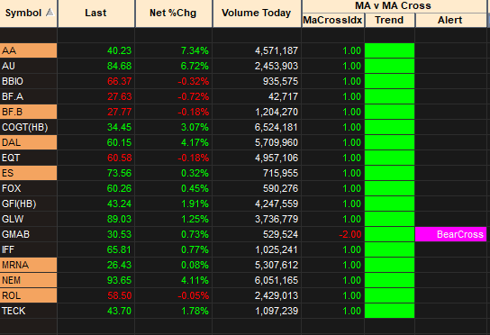

# MA v MA Cross

Tradestation indicator that shows (simple) Moving Average crossovers. And also shows the current *trend* based on the last cross.

*My primary use for this is within Tradestation's Scanner.*

---

#### NOTE

- This does not support any kind of equal MA situations. This will default to which ever side the last crossover was on.
- Radarscreen Trend does not update untill the confirmation on close. It will show the last confirmed trend until then. All other values update intrabar.

#### TODO

- [x] Better visual support in Radarscreen (currently that is not it's main use case)

